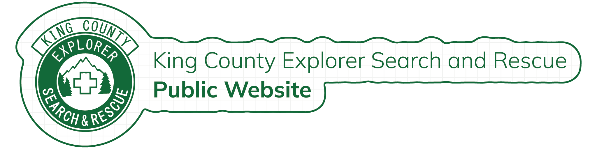

<h1 align="center">
  kcesar_2024_website
</h1>
<h2 align="center">

</h2>
<h2 align="center">
  The Modern Public Website for Our Organization
</h2>

<div align="center">

&nbsp;&nbsp;&nbsp;[Bun][bun-link]&nbsp;&nbsp;&nbsp;|&nbsp;&nbsp;&nbsp;[Next.js][nextjs-link]&nbsp;&nbsp;&nbsp;|&nbsp;&nbsp;&nbsp;[TailwindCSS][tailwind-link]&nbsp;&nbsp;&nbsp;|&nbsp;&nbsp;&nbsp;[DaisyUI][daisyui-link]

[![Made By Volunteers][volunteers-badge]][for-the-badge-link] [![Made with Typescript][typescript-badge]][for-the-badge-link] [![Made With Next.js][nextjs-badge]][for-the-badge-link]

</div>

## Architecture and Design
### Runtime
[Bun][bun-link] is the JavaScript/TypeScript runtime for this project. It was chosen purely based upon speed. When developing locally, fast bundling and reloads are key to providing a good experience. When compared to Node.js/Deno, Bun is significantly much faster and provides other optional speed-ups provided by tools that have been rewritten in Rust, such as Turbopack.
### Framework
[Next.js][nextjs-link] is the framework that was chosen for this project due to it's current use in the respond app and developer familiarity within the organization. Within the Next.js ecosystem, this project utilizes the App Router, which is now preferred for new projects.
### Styling
[TailwindCSS][tailwind-link] is now a built-in option in the `create-next-app@latest` flow. It is very convenient and provides more approachable styling when compared to raw CSS or other options. On top of TailwindCSS, we chose to leverage [DaisyUI][daisyui-link] components as they provide theming (light/dark especially) out of the box, with the possibility of extending the theme later on. In addition, they are pure TailwindCSS and don't require any extra JavaScript. With a wide variety of components available, you should be able to find what you need with ease.
### Components/Dependencies
* `react-countup`
  * This component is used on the home page to provide an interactive count-up animation for the various statistics
* `react-icons`
  * This component library is used across the site for icons such as social logos and navigation symbols


## Development
### Prerequisites
1. Install Bun
   1. `curl -fsSL https://bun.sh/install | bash` - Bun can be installed with the previous command on Linux and macOS. As always, exercise caution when copying commands from the internet.
2. Install Packages with Bun
   1. `bun i`

### Building

Please use `bun run dev` to build and run the application locally.

## Adding New Pages
Next.js App Router uses the folder structure to define routes.

> Folders are used to define routes. A route is a single path of nested folders, following the file-system hierarchy from the root folder down to a final leaf folder that includes a page.tsx

For example, to add a page at `https://myexamplewebsite/example`, in the `app` directory, we would need to add a folder titled `example` with a file inside called `page.tsx`. Within that file would be the contents below defining our page. I have provided the minimal amount of code that preserves the basic styling of this site. In the next section I have defined additional components that can be leveraged in your own pages!

<details open>
<summary>Minimum Viable Implementation</summary>

```ts
import Banner from "@/components/banner/banner";
import BasicLayout from "@/components/layout/basiclayout";
import Subtitle from "@/components/text/subtitle";
import BasicBody from "@/components/layout/basicbody";
import CenteredText from "@/components/text/centeredtext";

export default async function Example() {
  return (
    <BasicLayout>
      <Banner
        title="Example"
        location="/example-static-image.png"
        alt="Example static image"
      />
      <BasicBody>
        <Subtitle content="Example Page" />
        <CenteredText
          content="Forests in Washington State are known for their lush greenery and 
        diverse ecosystems, ranging from temperate rainforests on the Olympic Peninsula to dense 
        coniferous forests in the Cascade Mountains. These forests are dominated by towering 
        Douglas fir, western hemlock, and red cedar trees, creating rich habitats for wildlife 
        like black bears, elk, and the endangered northern spotted owl. The state's climate, with 
        its heavy rainfall and mild temperatures, fosters the growth of dense underbrush and a vibrant 
        mossy landscape. Washington&apos;s forests play a vital role in the region's water cycle, carbon 
        storage, and outdoor recreation, attracting hikers, campers, and nature lovers year-round."
        />
      </BasicBody>
    </BasicLayout>
  );
}
```
</details>

## Custom Components
| Component                   | Component Folder | File               | Description                                                                                      |
|-----------------------------|------------------|--------------------|--------------------------------------------------------------------------------------------------|
| Banner                      | `banner`         | `banner.tsx`       | provides the image at the top of every page                                                      |
| DonateCard                  | `donate`         | `card.tsx`         | provides the card used for each donation type                                                    |
| SimpleDonateLinkButton      | `donate`         | `card.tsx`         | provides a button used in donation cards that includes a button icon (such as Venmo or Facebook) |
| PaypalDonateButton          | `donate`         | `card.tsx`         | provides a PayPal specific donation button (on it's own due to specific implemetation required)  |
| Footer                      | `footer`         | `footer.tsx`       | provides the footer that is used in the main layout                                              |
| GridImage                   | `home`           | `gridimage.tsx`    | provides the images used on the home page in large screen layouts                                |
| GridText                    | `home`           | `gridtext.tsx`     | provides the accompanying text for the images in GridImage                                       |
| Hero                        | `home`           | `hero.tsx`         | provides the video and text on the home page (where the initial load occurs)                     |
| SmallImage                  | `home`           | `smallimage.tsx`   | provides the images used on the home page in small or mobile screen layouts                      |
| Stats                       | `home`           | `stats.tsx`        | provides the count-up statistics used on the home page                                           |
| Video                       | `home`           | `video.tsx`        | provides the video used on the Hero                                                              |
| BasicImage                  | `image`          | `basicimage.tsx`   | provides the most common implementation of a Next.js Image with styling                          |
| InstagramEmbed              | `instagram`      | `instagram.tsx`    | provides the embedded Instagram that points to `kingcounty_esar`                                 |
| Application                 | `join-us`        | `application.tsx`  | provides the boolean training application open/closed text and form button                       |
| Links                       | `join-us`        | `links.tsx`        | provides the links that are present below the banner image on each join-us page                  |
| BasicBody                   | `layout`         | `basicbody.tsx`    | provides the consistent body width and padding on each page                                      |
| BasicLayout                 | `layout`         | `basiclayout.tsx`  | provides the consistent page layout (wraps all content on page)                                  |
| Drawer                      | `navbar`         | `drawer.tsx`       | provides the pop-out navigation menu on smaller screen layouts                                   |
| EndButtons                  | `navbar`         | `end-buttons.tsx`  | provides the always-present donate button in the navbar                                          |
| Links                       | `navbar`         | `links.tsx`        | provides the links at the top-center in the navbar at larger screen layouts                      |
| Logo                        | `navbar`         | `logo.tsx`         | provides the logo in the navbar                                                                  |
| Navbar                      | `navbar`         | `navbar.tsx`       | provides the navbar element in the main layout (including scroll-driven background)              |
| BasicLink                   | `navigation`     | `basiclink.tsx`    | provides a consistently-styled link button                                                       |
| CenteredText                | `text`           | `centeredtext.tsx` | provides the most common implementation of text on each page                                     |
| CenteredTextMinimalXPadding | `text`           | `centeredtext.tsx` | provides a special implementation of CenteredText used on the home page                          |
| Subtitle                    | `text`           | `subtitle`         | provides the subtitles used on each page                                                         |

<!--

Reference Variables

-->

<!-- Badges -->
[typescript-badge]: .github/images/made-with-typescript.svg
[nextjs-badge]: .github/images/made-with-next.js.svg
[volunteers-badge]: .github/images/made-by-volunteers.svg

<!-- Links -->
[blank-reference-link]: #
[for-the-badge-link]: https://forthebadge.com
[grpc-go-documentation-link]: https://grpc.io/docs/languages/go/

[ko-k8s-apps-yaml]: https://github.com/Kochava/ko-k8s-apps/tree/main/fisher

[nextjs-link]: https://nextjs.org/

[bun-link]: https://bun.sh/

[daisyui-link]: https://daisyui.com/

[tailwind-link]: https://tailwindcss.com/