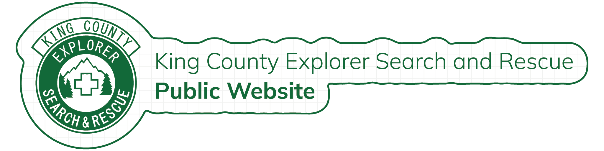

<h2 align="center">

</h2>

<div align="center">

&nbsp;&nbsp;&nbsp;[Bun][bun-link]&nbsp;&nbsp;&nbsp;|&nbsp;&nbsp;&nbsp;[Next.js][nextjs-link]&nbsp;&nbsp;&nbsp;|&nbsp;&nbsp;&nbsp;[TailwindCSS][tailwind-link]&nbsp;&nbsp;&nbsp;|&nbsp;&nbsp;&nbsp;[DaisyUI][daisyui-link]

[![Made By Volunteers][volunteers-badge]][for-the-badge-link] [![Made with Typescript][typescript-badge]][for-the-badge-link] [![Made With Next.js][nextjs-badge]][for-the-badge-link]

</div>

Informational/marketing site for **King County Explorer Search & Rescue (ESAR)** —
Next.js 15 (App Router) + React 19 + TypeScript, Tailwind CSS v4 + daisyUI v5,
run and built with **Bun**. Deployed as a Node standalone app to Azure App
Service, with per-PR previews on Vercel.

> **Contributing with an AI agent?** Read [`CLAUDE.md`](./CLAUDE.md) — it is the
> source of truth for the design system, tooling, testing, and config gotchas.
> This README is the human-oriented overview.

## Tech stack

| Layer | Choice | Notes |
|-------|--------|-------|
| Runtime / package manager | [Bun][bun-link] | fast installs + bundling; lockfile is `bun.lockb`. **Not** npm/yarn/pnpm. |
| Framework | [Next.js][nextjs-link] 15 (App Router) | statically rendered; `output: 'standalone'` for Azure |
| UI | React 19 + TypeScript | |
| Styling | [TailwindCSS][tailwind-link] v4 + [daisyUI][daisyui-link] v5 | custom `esar` theme in `app/globals.css` |
| Fonts | Adobe Typekit (`use.typekit.net/xyo6wwn`) | `gin`, `trade-gothic-next`, `stratum-2-web` |
| Misc | `react-countup` (stat count-ups), `react-icons` (social/nav icons), `jsonp` (Mailchimp) | |

## Design system — "Deep Forest / Field Ops"

A deep-evergreen palette, a rugged/technical type system, and a **topographic**
signature (land navigation is a core SAR skill). Full detail and rules live in
[`CLAUDE.md`](./CLAUDE.md); the essentials:

- **Palette** — `Timber #0b1f16` (base) · `Canopy #10271b` (surfaces) ·
  `ESAR Green #026737` (brand) · `Trail #34c56e` (links/interactive) ·
  `Beacon #f26a21` (Donate only) · `Bone #f3f6f1` / `Lichen #9db1a4` (text) ·
  `Moss #2e5e43` (lines). Exposed as both the daisyUI `esar` theme and Tailwind
  utilities (`bg-timber`, `text-trail`, `border-moss`, …).
- **Type (3 roles)** — `font-gin` (condensed display: titles/headings/stats),
  `font-trade-gothic-next` (body), `font-stratum` (small uppercase "map
  annotation" labels: eyebrows, nav, buttons).
- **Signature** — topographic contours + a fractal mountain ridge. Home gets the
  full treatment (video hero → `MountainRidge` → `TerrainField`); interior pages
  get a faint `Contour` backdrop in the body; a dashed `ridgeline` divides
  sections.
- **Convention** — cards are `bg-canopy border border-moss/40` with a `gin`
  title; don't invent new card styles, new fonts, or default-blue links, and
  don't put an "eyebrow" kicker above every heading (reserve eyebrows for real
  info). See `CLAUDE.md` for the reasoning.

### Topographic art is generated

The contour/terrain SVG data is produced deterministically by scripts in
`tools/topo/` — **do not hand-edit** the generated files
(`components/topo/contour.tsx`, `components/topo/terrain-data.ts`). To change the
terrain, edit the generator and re-run:

```bash
bun run gen:topo        # regenerate both
bun run gen:contours    # just the interior/stats Contour field
bun run gen:terrain     # just the shared home mountain + terrain field
```

## Development

**Prerequisites**

1. Install Bun — `curl -fsSL https://bun.sh/install | bash` (exercise caution
   running install scripts from the internet).
2. Install packages — `bun install`

**Common commands**

| Task | Command |
|------|---------|
| Dev server | `bun run dev` |
| Production build | `bun run build` |
| Lint | `bun run lint` |
| Type check | `bun run typecheck` |
| Unit tests (`tests/unit/`) | `bun run test` |
| E2E tests (`e2e/`, Playwright) | `bun run test:e2e` |
| Regenerate topo art | `bun run gen:topo` |

## Adding New Pages

Next.js App Router uses the folder structure to define routes: a folder under
`app/` with a `page.tsx` becomes a route (e.g. `app/example/page.tsx` →
`/example`). Interior pages follow this pattern — `BasicLayout` supplies the
faint topographic backdrop, `Banner` the photo header, `BasicBody` the content
column:

```tsx
import type { Metadata } from "next";
import Banner from "@/components/banner/banner";
import BasicLayout from "@/components/layout/basiclayout";
import BasicBody from "@/components/layout/basicbody";
import Subtitle from "@/components/text/subtitle";
import CenteredText from "@/components/text/centeredtext";

export const metadata: Metadata = {
  title: "Example",
  description: "…",
  alternates: { canonical: "/example" },
};

export default async function Example() {
  return (
    <BasicLayout>
      <Banner
        title="Example"
        eyebrow="Optional kicker"
        location="/example-static-image.png"
        alt="Describe the image"
      />
      <BasicBody>
        <Subtitle content="Example Page" />
        <CenteredText content="Body copy in the trade-gothic body face…" />
      </BasicBody>
    </BasicLayout>
  );
}
```

## Shared components (`components/`)

Reusable building blocks. Page-specific components live next to their route
under `app/` (e.g. `app/about/card.tsx`, `app/join-us/training-materials/`,
`app/mapwork/quizItem.tsx`).

| Component | Folder / file | Description |
|-----------|---------------|-------------|
| `Banner` | `banner/banner.tsx` | full-bleed photo header + timber gradient + `gin` title + optional eyebrow |
| `DonateButton` | `donate/button.tsx` | the Beacon-orange Donate button in the navbar |
| `DonateCard`, `PaypalDonateButton`, `SimpleDonateLinkButton` | `donate/card.tsx` | donation option cards + buttons |
| `Footer` | `footer/footer.tsx` | navigation footer (canopy, ESAR-green top rule, link columns, Beacon donate CTA, social) |
| `Hero` | `home/hero.tsx` | home hero: logo, eyebrow, `gin` title, CTA (over the video) |
| `Video` | `home/video.tsx` | fixed full-bleed hero background; poster on mobile / reduced-motion, video otherwise |
| `Stats` | `home/stats.tsx` | count-up statistic (`react-countup`), `gin` numerals |
| `GridImage`, `GridText`, `SmallImage` | `home/*.tsx` | home "who we are / join / donate" grid pieces |
| `BasicImage` | `image/basicimage.tsx` | standard styled Next.js `Image` |
| `InstagramEmbed` | `instagram/instagram.tsx` | embedded `kingcounty_esar` feed |
| `Application` | `join-us/application.tsx` | training-open/closed copy + CTAs |
| `Links` | `join-us/links.tsx` | the stratum sub-nav under the banner on join-us pages |
| `BasicLayout` | `layout/basiclayout.tsx` | page wrapper; renders the faint interior `Contour` backdrop (pass `contour={false}` to opt out, e.g. the home page) |
| `BasicBody` | `layout/basicbody.tsx` | content column: max width + horizontal padding |
| `MailchimpSubscribeForm`, `MailchimpSubscibeModal` | `mailchimp/*.tsx` | newsletter signup (inline form + modal); shared fields in `mailchimp.tsx` |
| `Navbar` | `navbar/navbar.tsx` | sticky navbar; transparent → `bg-timber/85` on scroll |
| `Drawer` | `navbar/drawer.tsx` | mobile slide-out menu (daisyUI drawer) |
| `EndButtons`, `Links`, `Logo` | `navbar/*.tsx` | newsletter/donate buttons, center links, logo |
| `BasicLink` | `navigation/basiclink.tsx` | consistently-styled link button (stratum, esar-green) |
| `Subtitle`, `SubSubtitle` | `text/subtitle.tsx` | `gin` section heading / body-face supporting subheading |
| `CenteredText` (+ variants) | `text/centeredtext.tsx` | standard body-copy blocks |
| `Contour` | `topo/contour.tsx` | ambient zoomed-out contour backdrop, used site-wide (generated) |
| `MountainRidge` | `topo/mountain.tsx` | home hero→content mountain ridge silhouette (generated data) |

<!--

Reference Variables

-->

<!-- Badges -->
[typescript-badge]: .github/images/made-with-typescript.svg
[nextjs-badge]: .github/images/made-with-next.js.svg
[volunteers-badge]: .github/images/made-by-volunteers.svg

<!-- Links -->
[for-the-badge-link]: https://forthebadge.com
[nextjs-link]: https://nextjs.org/
[bun-link]: https://bun.sh/
[daisyui-link]: https://daisyui.com/
[tailwind-link]: https://tailwindcss.com/
